# 💥🔫 DAYDREAM 💥🔫

💭 **¿Has sentido alguna vez tu imaginacion es tu unico refugio?** 💭

### 🛠️ DESARROLLADO POR **L.U.F.A.D Studios**

- 👩‍💼 [Luisa Saenz](https://lusaenz.itch.io/) - Project Manager / Enemy Behavior Programmer.
- 👨‍💻 [Fabian Rincon](https://arcktx.itch.io/) - Programmer.
- 🎨 [Andres Muñoz](https://andrew-blackstar.itch.io/) - 3D Artist / UI-UX Design.
- 👨‍💻 [Jose Carranza](https://josedavdmast3r.itch.io/daydream) - Programmer.

---
### 📁 Documents and Repositories

  
  
  

---

### 🎥 VIDEO DEL GAMEPLAY  
<a href="" target="_blank">
  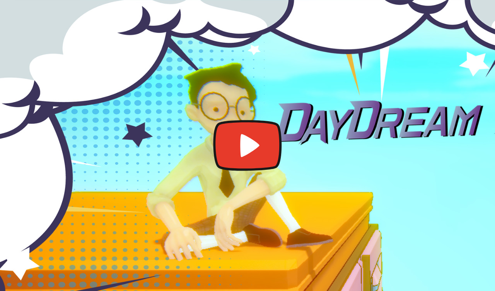
</a>

#### 🛡️ Género: Shooter 3D Subrealista 

#### 🌌 Escenario: Un mundo surrealista e inestable  basado en la imaginación.

#### 🎯 Objetivo: Sobrevivir en niveles con glitches y físicas impredecibles

---

### 🎯 HISTORIA

Sumérgete en un universo surrealista donde nada es estable. En **Daydream**, encarnas a un personaje atrapado en una dimensión distorsionada: las armas tienen comportamientos impredecibles, la física no obedece reglas y los niveles están diseñados para confundirte y desafiarte. 

Inspirado en shooters clásicos, **Daydream** le da un giro moderno y glitchy que hará que tu percepción del caos evolucione.

---

### ENEMIGOS Y RETOS

Prepárate para enfrentarte a enemigos inesperados y mecánicas que no siguen reglas convencionales. Aquí, incluso tu imaginación es el unico refugio.

---

### 🔄 MECÁNICAS DE JUEGO

- 🧠 **Físicas exageradas**: Los disparos y explosiones desafían las leyes de la realidad.
- 💥 **Glitches intencionales**: Efectos visuales y mecánicos diseñados para desestabilizar tu estrategia.
- 🎲 **Diseño caótico**: Niveles retadores con fisicas exageradas.
- 🔫 **Comportamiento impredecible de armas**: Cada arma se siente única, con efectos inesperados.

---

### 🎮 CONTROLES

- ⌨️ **Movimiento**: Usa `W`, `A`, `S`, `D`
- 🔄 **Cambiar arma**: Usa `Tab`
- ⏸️ **Pausar**: Usa `Escape`

---

## 🌟 SCREENSHOTS DEL JUEGO

| 🎮 Juego | 🦠 Enemigos y Jugador | 🎨 Menu inicial | 🎨 Menu principal |
|------------|----------------------|-------------|--------|
| [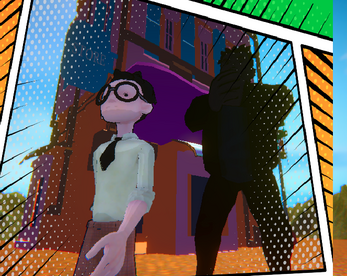](./DataGame/Cinematica1.png) | [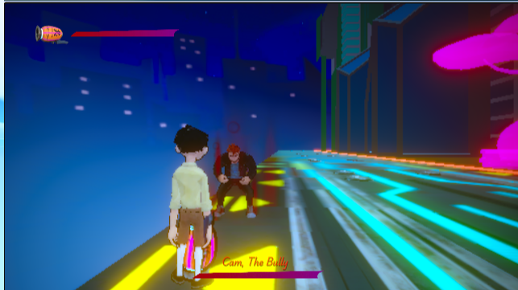](./DataGame/EnemigoJugador.png) | [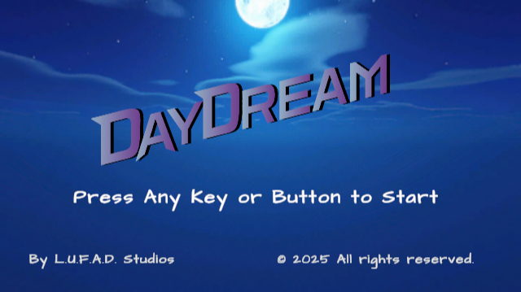](./DataGame/MenuInicial.png) | [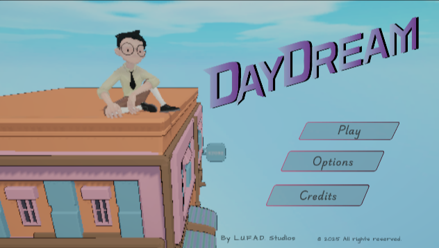](./DataGame/MenuPrincipal.png) |

| ⏸️ Pantalla de Pausa | 🚀 Jugador | 📜 Tutorial |
|------------|------------|------------|
| [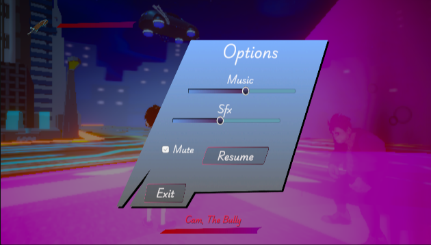](./DataGame/Pausa.png) | [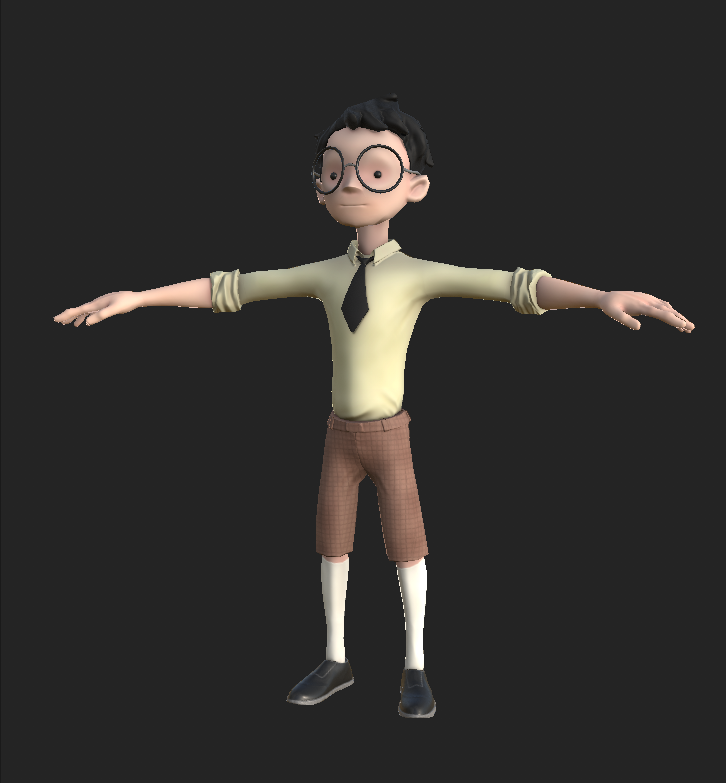](./DataGame/Player.png) | [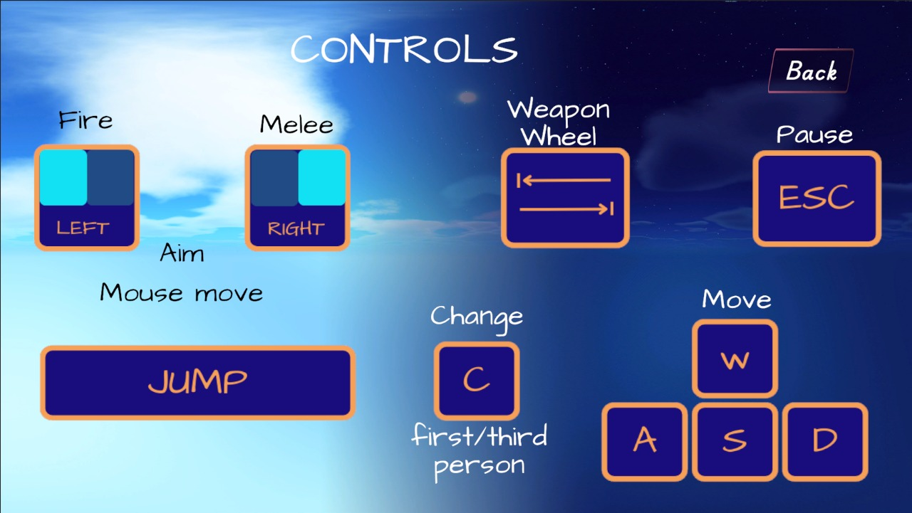](./DataGame/Controls.jpg) |

| 💀 Game Over | 🏆 Win |
|------------|------------|
| [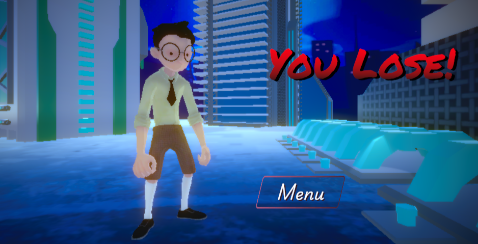](./DataGame/GameOver.png) | [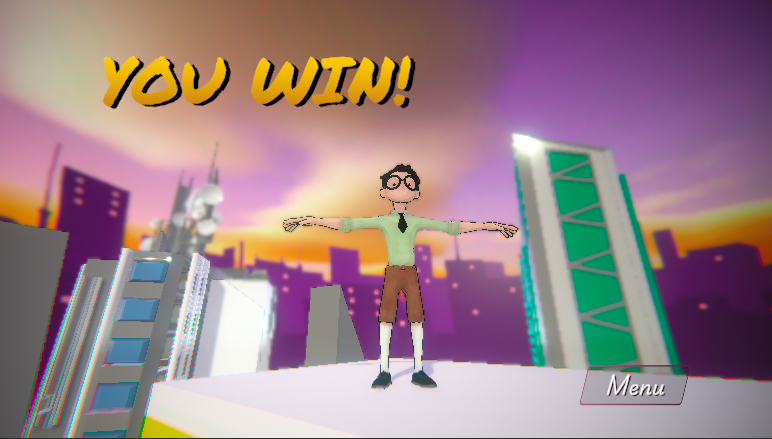](./DataGame/YouWin.png) |

| 🎬 Portada | 🎭 Créditos |
|------------|------------|
| [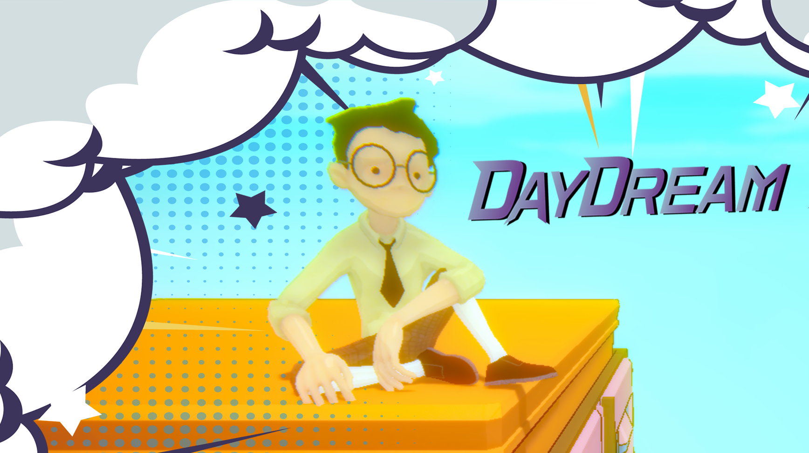](./DataGame/portada.png) | [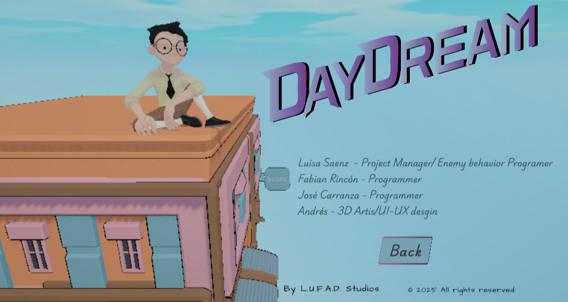](./DataGame/Creditos.png) |

---

